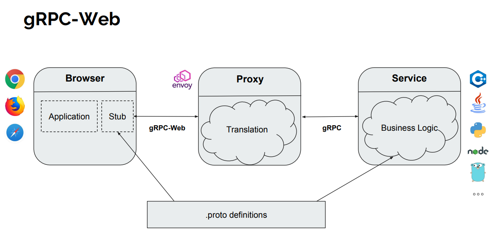

## GRPC Web

in our current browsers the http client layer is so much abstracted so we cant get the required data with XHR or Fetch and thats the reason we can have a direct implementation of GRPC in browsers.

But we have a current particular flow with which we can build an whole client(browser) server mechanism with GRPC the architecture for it looks like this

The current limitation of this architecture is we can only make **Unary call and Server Side Streaming Calls**

Modes of Communication in GRPC-Web

- Default: grpcwebtext (base64-encoded)
- Binary: grpcweb (only unary calls supported)

---

## Proto File Compiling into Js for Client Side
For Windows use version - 3.20.3 of protoc

* compile the proto files
   * protoc.exe todo.proto --js_out=import_style=commonjs:.
   * protoc.exe todo.proto --grpc-web_out=import_style=commonjs,mode=grpcwebtext:.

* move both the output files into web-client folder

* build the client side js file bundle with `yarn webpack client.js`